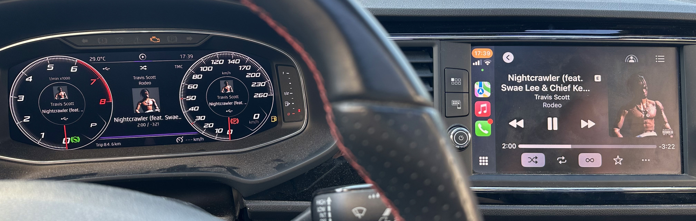
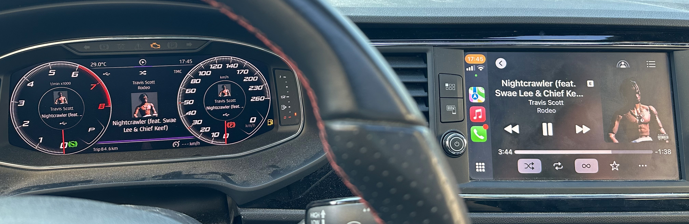
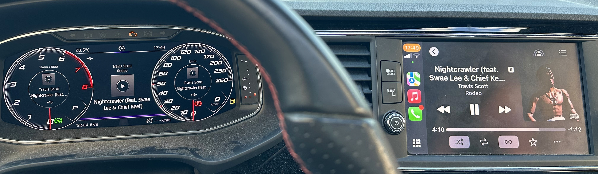
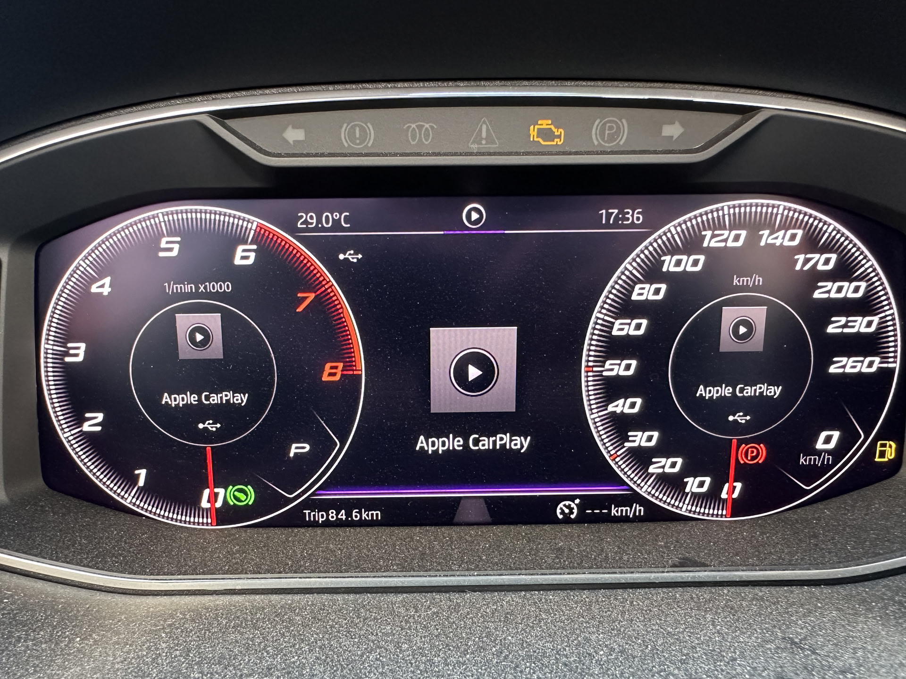
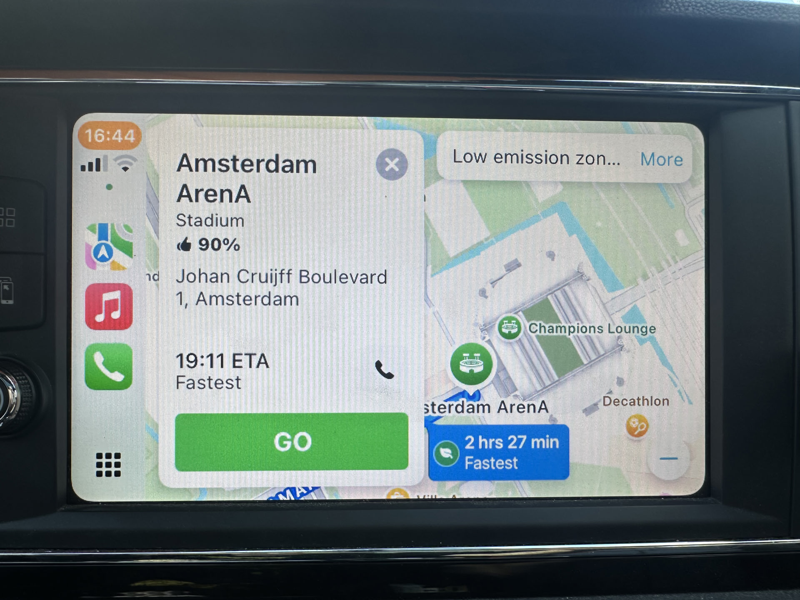
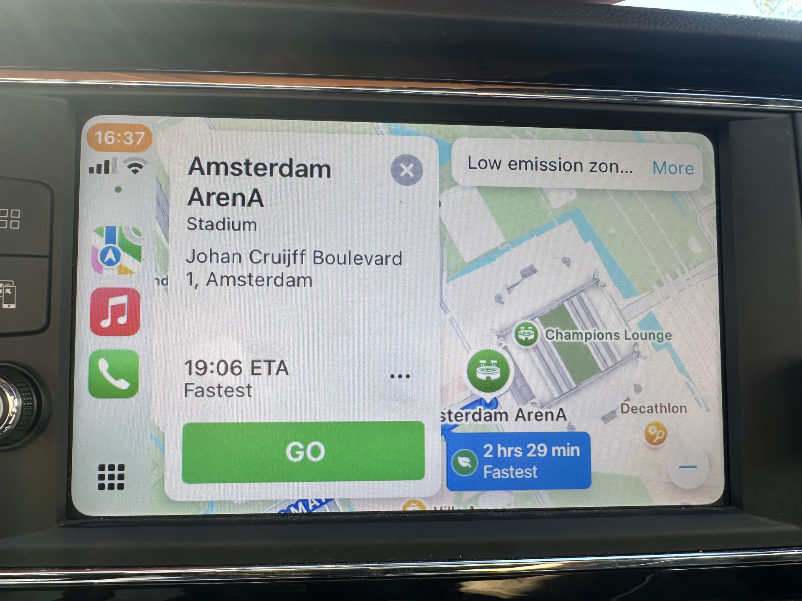
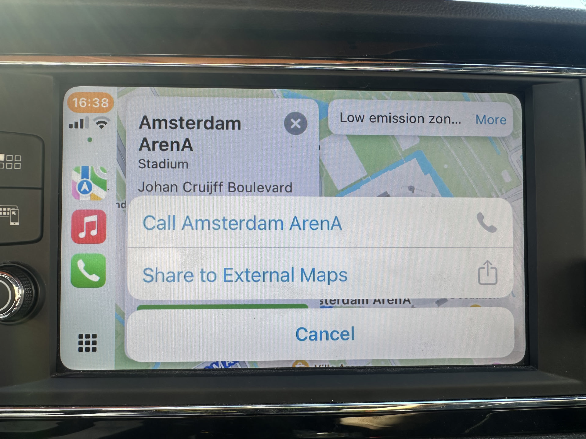

# Screenshots

**Full Patch**

**no-navi-no-prog**

**Lite**

**Stock**

## navigation import (EU full)

**Stock**

**Patched**

**Share to External Maps**

-placeholder for pic of internal mib2 navi coordinates-
